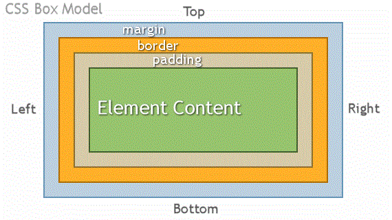

## HTML Chapter 3 *(List)*
There 3 types of HTML lists:
  1. Ordered lists \<ol>\</ol>
      - each item in the list is numbered
  2. Unordered lists \<ul>\</ul>
      - items in these lists begin with a bullet point
  3. Definiion lists \<dl><\/dl>
      - use for a for a set of terms along with the definitions for each of those terms

## HTML Chapter 13 *(Boxes)*

## JavaScript Chapter 4 *(Decisions and Loops)*

If vs switch. With a series of if statements, they are all checked, even if a match has been found. It performs slower. With switch, we have a default option in case none of the cases match. When a match is found that code is run, and the break statement stops the other switch statements running. This improves performance.
