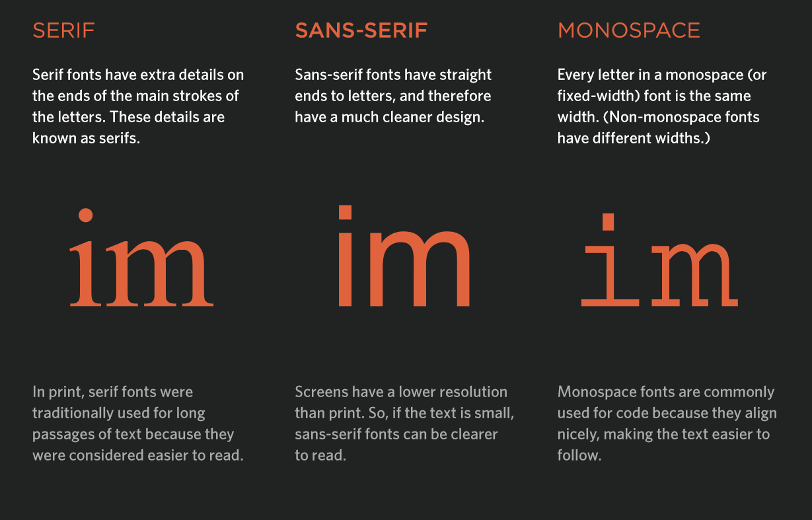
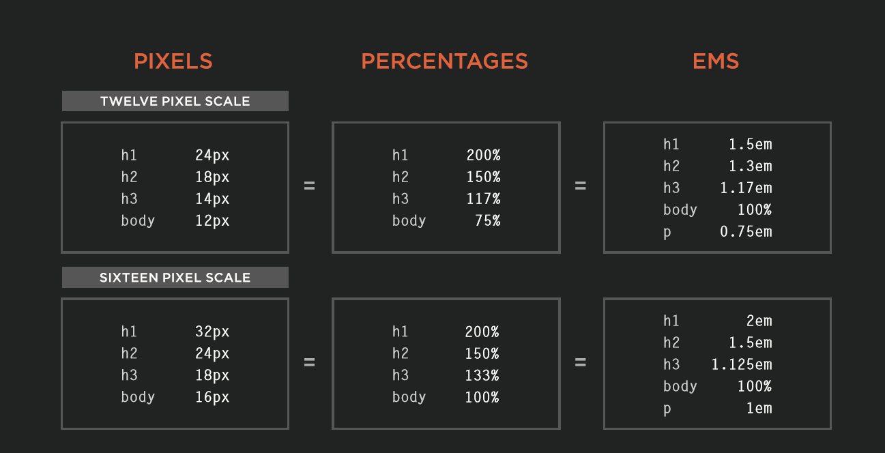

## HTML Chapter 5 *(Images)*

Images should:
  - Be relevant
  - Convey information
  - Convey the right mood
  - Be instantly recognisable
  - Fit the color palet

It is best practice to store the images in a folder in your directory. Images are added using the \ element, with 2 attributes: src and alt. To specify an image size, we use the height and width attributes. 

HTML5 introduced new elements \<figure> and \<figcaption> to contain images and their caption. 

## HTML Chapter 11 *(Color)*

The color property allows us to specify the color of the text inside an element. We can use RGB, HEX, or Color names values.

  * RGB: values for red, green, and blue are expressed as numbers. rgb(102.205.255)
  * HEX: values for red, green, and blue are represented in hexadecimal code. #66cdaa
  * Color Name: colors are represented by predefined names. They are 147 colors supported by browsers. color: blue;

The background-color sets the color of the entire box. 

Opacity allows us to specify the opacity of an element. RGBA allows us to specify a coloe and it adds a fourth value to indicate the opacity. 

## HTML Chapter 12 *(Text)*

When choosing a typeface, it is important to understand that the browser will usually only display it if it's installed on the user's computer. It is a good idea to add a generic font after your preferred choice. I.E. font-family: Georgia, Times, serif;

### font-size

This property enables us to specify the size for the font. You can use:
  - Pixels: the default size in browswers is 16px. 
  - Percentages: a size of 200% would be 32px.
  - ems: this is equivalent to the with of the letter m.

  ### Units of type size

  
