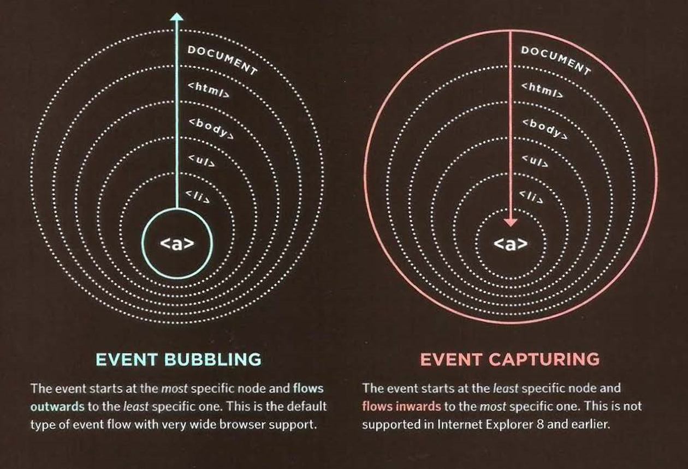

## HTML Chapter 7 *(Forms)*

Forms refer to different elements that allow you to collect information from visitors to your site. Some of the form controls are:
  - Text input
  - Password input
  - Text area 
  - Radio buttons
  - Checkoxes
  - Drop down boxes
  - Submit buttons

This how forms work:
1. The user fill in a form and presses a button to submit the information to the server.
2. The name of each form control is sent to the server along with the valie the user entered. (name/value pairs).
3. The server processes the information using a programming language.
4. The server creates a new page to send back to the browser on the information received. 

## HTML Chapter 14 *(List, Tables, Forms)*

- List markers can be given different appearances using list-style-type and list-style-image properties. 
- Table cells can have different borders and spacing in different browsers.
- Forms are easier to use if the form controls are vertically aligned using CSS.

```
Stylying table elements:

th, td {    
  text-align: left;    
  background-color: #e0e9f0;    
  border-top: 1px solid #f1f8fe;    
  border-bottom: 1px solid #cbd2d8;    
  border-right: 1px solid #cbd2d8;
}   

tr.head th {    
  color: #fff;    
  background-color: #90b4d6;    
  border-bottom: 2px solid #547ca0;    
  border-right: 1px solid #749abe;    
  border-top: 1px solid #90b4d6;    
  text-align: center;    
  text-shadow: -1px -1px 1px #666;    
  letter-spacing: 0.15em;
} 

```

## JavaScript Chapter 6 *(Events)*

Events are the browser's way of indicating when something has happened. When an event occurs on an element, it can trigger a JS function. When this function changes the web page, it feels interactive because it has responded to the user. 

HTML elements nest insie other elements. If you hover or click on a link, you will also be hovering or clicking on its parent elements. 

